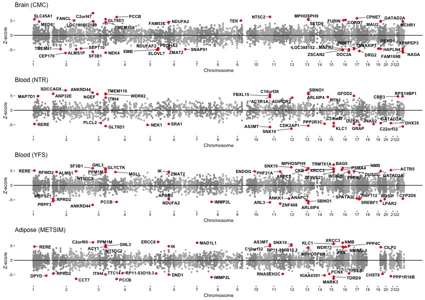

Supporting Materials for the manuscript **"Transcriptome-wide association study of schizophrenia and chromatin activity yields mechanistic disease insights"** *Alexander Gusev, Nick Mancuso, Hilary Finucane, Yakir Reshef, Lingyun Song, Alexias Safi, Edwin Oh, Schizophrenia Working Group of the Psychiatric Genomics Consortium, Steven McCarroll, Benjamin Neale, Roel Ophoff, Michael C O'Donovan, Nicholas Katsanis, Gregory E Crawford, Patrick F Sullivan, Bogdan Pasaniuc and Alkes L Price* (2016) [in submission] [[preprint](http://biorxiv.org/content/early/2016/08/02/067355)]

This page provides the documentation and data for analysis of gene expression, chromatin variation, and schizophrenia GWAS. For a general tutorial on TWAS, please see the main documentation at [http://sashagusev.github.io/TWAS](http://sashagusev.github.io/TWAS).

For questions or comments, contact Alexander Gusev [[agusev@hsph.harvard.edu](mailto:agusev@hsph.harvard.edu)].

---

## SCZ TWAS genes at a glance

Manhattan plot of SCZ TWAS associations from each expression reference panel. Each point represents an individual gene with physical position on the x-axis and (signed) Z-score for association on the y-axis.

## SCZ & chromatin associations in detail

All transcriptome-wide significant TWAS associations and any corresponding chromatin associations.

<iframe frameborder="no" border="0" marginwidth="0" marginheight="0" width="100%" onload="this.style.height=this.contentDocument.body.scrollHeight +'px';" src="plots/TWAS_RESULTS.html"></iframe>

**Study:** Expression reference panel used for TWAS (CMC/brain; NTR/blood; YFS/blood; MET/adipose). **Z:** Z-score for TWAS association, positive sign means increased expression leads to increased risk. **INFO:** Expected TWAS prediction R2. **GWAS P:** P-value of the best GWAS SNP in the 1MB locus. **joint:** Whether this gene was significant in a joint model using all genes (across all expression panels). **chromatin:** Chromatin TWAS associations (if any). *Note: Use search bar to filter chromatin phenotypes (H3k27ac, H3k4me1, H3k4me3, DHS, RPB2, PU1) or reference panels.*

---

## Data

| All SCZ TWAS association results across four expression reference panels | [[download](https://data.broadinstitute.org/alkesgroup/TWAS/CHROMATIN_TWAS/TWAS.PGC.SCZ2.ALL.zscores.bz2)] |
| All chromatin-TWAS associations | [[download](https://data.broadinstitute.org/alkesgroup/TWAS/CHROMATIN_TWAS/TWAS.CHROMATIN.ALL.assoc.tar.bz2)] |
| TWAS expression weights | [[link](https://data.broadinstitute.org/alkesgroup/TWAS/)] |
| Supplementary Text, Figures, and Tables | [[pdf](https://data.broadinstitute.org/alkesgroup/TWAS/CHROMATIN_TWAS/Gusev_etal_SCZ_chromatin_TWAS_SUPP.pdf)]
| Associations Spreadsheet | [[xlsx](https://data.broadinstitute.org/alkesgroup/TWAS/CHROMATIN_TWAS/Gusev_etal_SCZ_chromatin_TWAS_SUPP_SPREADSHEET.xlsx)]

## Change Log

* 2016/08/02 : Pre-print and data released
* 2016/05/26 : First draft

*Logo by [Ryan Beck](https://thenounproject.com/Ryaaaan/) from The Noun Project*
